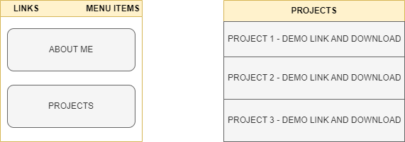

# Portfolio

# Wireframes #

# Portfolio #

* Bulma is a free, open source framework that provides ready-to-use frontend components that you can easily combine to build responsive web interfaces -  https://bulma.io/documentation/overview/start/

* Font Awesome is a font and icon toolkit based on CSS - https://fontawesome.com/ 

# Structure

|LINKS||
|--------|-------|
|Github| LinkedIn|

|MENU ITEMS|||
|--------|-------|-------|
|About | Projects| Resume |

* Section 1 - Intro
* Section 2 - Projects
* Section 3 - Resume
* Section 4 - Email